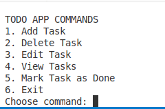
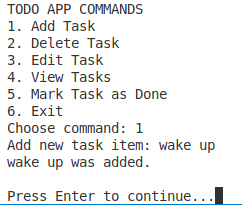
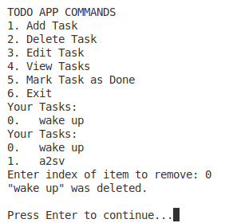
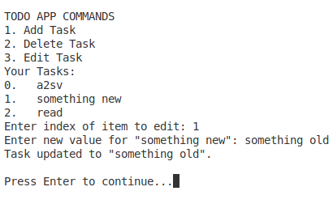
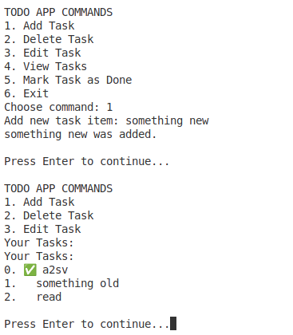
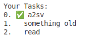

# TypeScript CLI Todo App

A simple command-line Todo application built with TypeScript.  
Users can add, edit, delete, mark tasks as done, and view their task list directly from the terminal.

 
## Features

### Add new tasks
- Prompts you to enter a new task and adds it to the list.

 
### Delete existing tasks  
- Lets you remove a task by entering its index number.

 
### Edit task names 
- Allows you to change the text of an existing task.  

 
### Mark tasks as completed  
- Displays all current tasks with their completion status. 

 
### View all tasks  
- Updates a task’s status to indicate it’s completed.

 
 
## Installation

1. Clone the repository:

   ```bash
   git clone https://github.com/yourusername/todo-ts-cli.git
   cd todo-ts-cli

2. Install dependencies:
    ```bash
    npm install prompt-sync

3. Compile TypeScript code:
    ```bash
    tsc script.ts

4. Run the compiled js file:
    ```bash
    node script.js

